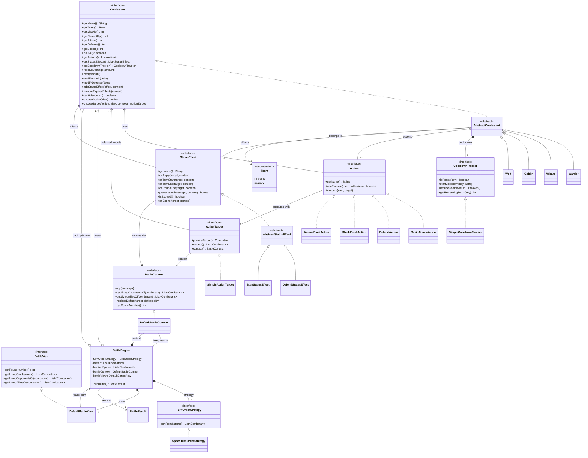

# 2002-combat

```mermaid
classDiagram
direction TB

class Combatant {
  <<interface>>
  +getName() String
  +getTeam() Team
  +getMaxHp() int
  +getCurrentHp() int
  +getAttack() int
  +getDefense() int
  +getSpeed() int
  +isAlive() boolean
  +getActions() List~Action~
  +getStatusEffects() List~StatusEffect~
  +getCooldownTracker() CooldownTracker
  +receiveDamage(amount)
  +heal(amount)
  +modifyAttack(delta)
  +modifyDefense(delta)
  +addStatusEffect(effect, context)
  +removeExpiredEffects(context)
  +canAct(context) boolean
  +chooseAction(view) Action
  +chooseTarget(action, view, context) ActionTarget
}

class Action {
  <<interface>>
  +getName() String
  +canExecute(user, battleView) boolean
  +execute(user, target)
}

class StatusEffect {
  <<interface>>
  +getName() String
  +onApply(target, context)
  +onTurnStart(target, context)
  +onTurnEnd(target, context)
  +onRoundEnd(target, context)
  +preventsAction(target, context) boolean
  +isExpired() boolean
  +onExpire(target, context)
}

class TurnOrderStrategy {
  <<interface>>
  +sort(combatants) List~Combatant~
}

class CooldownTracker {
  <<interface>>
  +isReady(key) boolean
  +startCooldown(key, turns)
  +reduceCooldownOnTurnTaken()
  +getRemainingTurns(key) int
}

class BattleContext {
  <<interface>>
  +log(message)
  +getLivingOpponentsOf(combatant) List~Combatant~
  +getLivingAlliesOf(combatant) List~Combatant~
  +registerDefeat(target, defeatedBy)
  +getRoundNumber() int
}

class BattleView {
  <<interface>>
  +getRoundNumber() int
  +getLivingCombatants() List~Combatant~
  +getLivingOpponentsOf(combatant) List~Combatant~
  +getLivingAlliesOf(combatant) List~Combatant~
}

class ActionTarget {
  <<interface>>
  +primaryTarget() Combatant
  +targets() List~Combatant~
  +context() BattleContext
}

class AbstractCombatant {
  <<abstract>>
}

class AbstractStatusEffect {
  <<abstract>>
}

class Warrior
class Wizard
class Goblin
class Wolf

class BasicAttackAction
class DefendAction
class ShieldBashAction
class ArcaneBlastAction

class DefendStatusEffect
class StunStatusEffect

class SimpleCooldownTracker
class SimpleActionTarget
class SpeedTurnOrderStrategy

class BattleEngine {
  -turnOrderStrategy : TurnOrderStrategy
  -roster : List~Combatant~
  -backupSpawn : List~Combatant~
  -battleContext : DefaultBattleContext
  -battleView : DefaultBattleView
  +runBattle() BattleResult
}

class DefaultBattleContext
class DefaultBattleView
class BattleResult
class Team {
  <<enumeration>>
  PLAYER
  ENEMY
}

Combatant <|.. AbstractCombatant
AbstractCombatant <|-- Warrior
AbstractCombatant <|-- Wizard
AbstractCombatant <|-- Goblin
AbstractCombatant <|-- Wolf

StatusEffect <|.. AbstractStatusEffect
AbstractStatusEffect <|-- DefendStatusEffect
AbstractStatusEffect <|-- StunStatusEffect

Action <|.. BasicAttackAction
Action <|.. DefendAction
Action <|.. ShieldBashAction
Action <|.. ArcaneBlastAction

CooldownTracker <|.. SimpleCooldownTracker
ActionTarget <|.. SimpleActionTarget
TurnOrderStrategy <|.. SpeedTurnOrderStrategy
BattleContext <|.. DefaultBattleContext
BattleView <|.. DefaultBattleView

BattleEngine *-- "1" TurnOrderStrategy : strategy
BattleEngine *-- "1" DefaultBattleContext : context
BattleEngine *-- "1" DefaultBattleView : view
BattleEngine o-- "1..*" Combatant : roster
BattleEngine o-- "0..*" Combatant : backupSpawn
BattleEngine --> "1" BattleResult : returns

AbstractCombatant *-- "1" CooldownTracker : cooldowns
AbstractCombatant o-- "0..*" Action : actions
AbstractCombatant o-- "0..*" StatusEffect : effects
AbstractCombatant --> "1" Team : belongs to

Action --> Combatant : uses
Action --> ActionTarget : executes with
ActionTarget --> "0..*" Combatant : selected targets
ActionTarget --> "1" BattleContext : context

StatusEffect --> Combatant : affects
StatusEffect --> BattleContext : reports via

DefaultBattleContext --> BattleEngine : delegates to
DefaultBattleView --> BattleEngine : reads from
```
