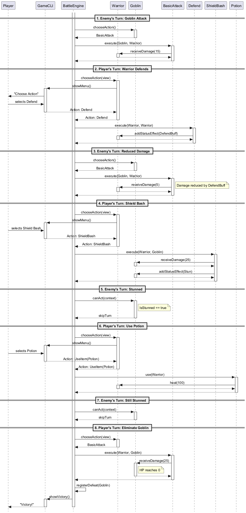

# Turn-Based Combat Arena

## Quick links:

- [Main Project Guide](main/README.md)
- [UML Class Diagram Source](main/UML_Class_Diagram/markdown/UML-class-diagram-full.md)
- [UML Class Diagram SVG](main/UML_Class_Diagram/svg/UML-class-diagram-full.svg)
- [Source Code](src/)

Main code is in `src/`.
Main documentation is in `main/`.

## UML Diagram

### Sequence Diagram

- [Sequence Diagram PlantUML](main/UML_Sequence_Diagram/plantuml/battle-sequence-diagram.puml)
- [Sequence Diagram SVG](main/UML_Sequence_Diagram/svg/battle-sequence-diagram.svg)
- [Sequence Diagram PNG](main/UML_Sequence_Diagram/png/battle-sequence-diagram.png)
