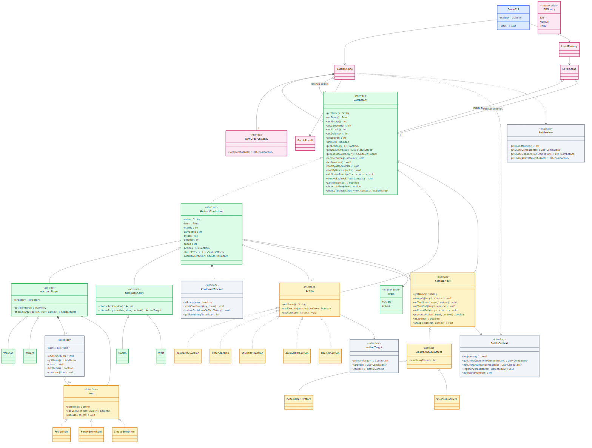

# Turn-Based Combat Arena

## Quick links:

- [Main Project Guide](main/README.md)
- [UML Class Diagram Source](main/UML_Class_Diagram/markdown/UML-class-diagram-simplified.md)
- [Implementation-Focused UML](main/UML_Class_Diagram/markdown/UML-class-diagram-implementation-focused.md)
- [UML Class Diagram SVG](main/UML_Class_Diagram/svg/UML-class-diagram-simplified.svg)
- [UML Explanation](main/UML_Class_Diagram/UML_Diagram_Explanation.txt)
- [Source Code](src/)

Main code is in `src/`.
Main documentation is in `main/`.

## Recommended reading order:

- `main/README.md`
- `main/UML_Class_Diagram/markdown/UML-class-diagram-simplified.md`
- `main/UML_Class_Diagram/markdown/UML-class-diagram-implementation-focused.md`
- `main/UML_Class_Diagram/UML_Diagram_Explanation.txt`
- `main/CLASS_GUIDE.md`
- `main/PROJECT_STRUCTURE.md`
- `main/TEAM_OWNERSHIP.md`
- `main/TEAM_STARTUP.md`

## UML Diagram

[Open SVG](https://raw.githubusercontent.com/carLHW/2002-combat/refs/heads/main/main/UML_Class_Diagram/svg/UML-class-diagram-simplified.svg) | [Open PNG](main/UML_Class_Diagram/png/UML-class-diagram-simplified.png)
