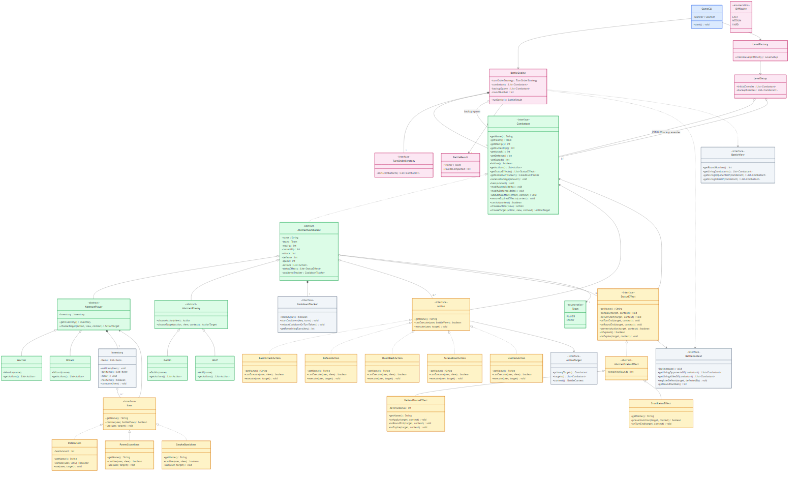

# Turn-Based Combat Arena

## Quick links:

- [Main Project Guide](main/README.md)
- [UML Class Diagram Source](main/UML_Class_Diagram/markdown/UML-class-diagram-simplified.md)
- [Implementation-Focused UML](main/UML_Class_Diagram/markdown/UML-class-diagram-implementation-focused.md)
- [UML Class Diagram SVG](main/UML_Class_Diagram/svg/UML-class-diagram-simplified.svg)
- [UML Explanation](main/UML_Class_Diagram/UML_Diagram_Explanation.txt)
- [Source Code](src/)

Main code is in `src/`.
Main documentation is in `main/`.

## Recommended reading order:

- `main/README.md`
- `main/UML_Class_Diagram/markdown/UML-class-diagram-simplified.md`
- `main/UML_Class_Diagram/markdown/UML-class-diagram-implementation-focused.md`
- `main/UML_Class_Diagram/UML_Diagram_Explanation.txt`
- `main/CLASS_GUIDE.md`
- `main/PROJECT_STRUCTURE.md`
- `main/TEAM_OWNERSHIP.md`
- `main/TEAM_STARTUP.md`

## UML Diagram

### Full UML (Complete Reference)

This version shows all classes with their complete methods — useful when implementing your assigned parts.

- [Full UML Markdown](main/UML_Class_Diagram/markdown/UML-class-diagram-full.md)
- [Full UML SVG](main/UML_Class_Diagram/svg/UML-class-diagram-full.svg)

### Teammate Work Areas (Color-Coded)

This version shows who works on what — colored by person, grey for shared structure.

- [Teammate Areas UML](main/UML_Class_Diagram/markdown/UML-class-diagram-teammate-areas.md)

| Person | Files | Area |
|--------|-------|------|
| 🔴 Person 1 | `GameCLI.java` | CLI flow |
| 🟠 Person 2 | `AbstractCombatant.java`, `AbstractPlayer.java`, `AbstractEnemy.java` | Shared base |
| 🟡 Person 3 | `Warrior.java`, `Wizard.java`, `Goblin.java`, `Wolf.java`, action classes | Combatants + actions |
| 🟢 Person 4 | `UseItemAction.java`, `*Item.java`, `StunStatusEffect.java` | Items + effects |
| 🔵 Person 5 | `BattleEngine.java`, `LevelFactory.java` | Engine + levels |
| ⚫ Shared | Interfaces | already done |

