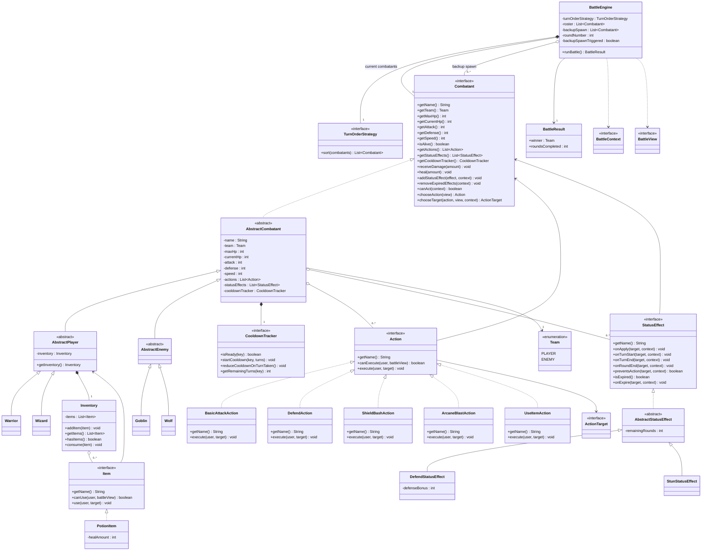

```mermaid
classDiagram
direction TB

class Combatant {
  <<interface>>
  +getName() String
  +getTeam() Team
  +getMaxHp() int
  +getCurrentHp() int
  +getAttack() int
  +getDefense() int
  +getSpeed() int
  +isAlive() boolean
  +getActions() List~Action~
  +getStatusEffects() List~StatusEffect~
  +getCooldownTracker() CooldownTracker
  +receiveDamage(amount) void
  +heal(amount) void
  +addStatusEffect(effect, context) void
  +removeExpiredEffects(context) void
  +canAct(context) boolean
  +chooseAction(view) Action
  +chooseTarget(action, view, context) ActionTarget
}

class Action {
  <<interface>>
  +getName() String
  +canExecute(user, battleView) boolean
  +execute(user, target) void
}

class StatusEffect {
  <<interface>>
  +getName() String
  +onApply(target, context) void
  +onTurnStart(target, context) void
  +onTurnEnd(target, context) void
  +onRoundEnd(target, context) void
  +preventsAction(target, context) boolean
  +isExpired() boolean
  +onExpire(target, context) void
}

class Item {
  <<interface>>
  +getName() String
  +canUse(user, battleView) boolean
  +use(user, target) void
}

class TurnOrderStrategy {
  <<interface>>
  +sort(combatants) List~Combatant~
}

class AbstractCombatant {
  <<abstract>>
  -name : String
  -team : Team
  -maxHp : int
  -currentHp : int
  -attack : int
  -defense : int
  -speed : int
  -actions : List~Action~
  -statusEffects : List~StatusEffect~
  -cooldownTracker : CooldownTracker
}

class AbstractPlayer {
  <<abstract>>
  -inventory : Inventory
  +getInventory() Inventory
}

class AbstractEnemy {
  <<abstract>>
}

class Warrior
class Wizard
class Goblin
class Wolf

class Inventory {
  -items : List~Item~
  +addItem(item) void
  +getItems() List~Item~
  +hasItems() boolean
  +consume(item) void
}

class BasicAttackAction {
  +getName() String
  +execute(user, target) void
}

class DefendAction {
  +getName() String
  +execute(user, target) void
}

class ShieldBashAction {
  +getName() String
  +execute(user, target) void
}

class ArcaneBlastAction {
  +getName() String
  +execute(user, target) void
}

class UseItemAction {
  +getName() String
  +execute(user, target) void
}

class AbstractStatusEffect {
  <<abstract>>
  -remainingRounds : int
}

class DefendStatusEffect {
  -defenseBonus : int
}

class StunStatusEffect

class PotionItem {
  -healAmount : int
}

class CooldownTracker {
  <<interface>>
  +isReady(key) boolean
  +startCooldown(key, turns) void
  +reduceCooldownOnTurnTaken() void
  +getRemainingTurns(key) int
}

class BattleEngine {
  -turnOrderStrategy : TurnOrderStrategy
  -roster : List~Combatant~
  -backupSpawn : List~Combatant~
  -roundNumber : int
  -backupSpawnTriggered : boolean
  +runBattle() BattleResult
}

class BattleResult {
  +winner : Team
  +roundsCompleted : int
}

class Team {
  <<enumeration>>
  PLAYER
  ENEMY
}

class BattleContext {
  <<interface>>
}

class BattleView {
  <<interface>>
}

class ActionTarget {
  <<interface>>
}

Combatant <|.. AbstractCombatant
AbstractCombatant <|-- AbstractPlayer
AbstractCombatant <|-- AbstractEnemy

AbstractPlayer <|-- Warrior
AbstractPlayer <|-- Wizard
AbstractEnemy <|-- Goblin
AbstractEnemy <|-- Wolf

Action <|.. BasicAttackAction
Action <|.. DefendAction
Action <|.. ShieldBashAction
Action <|.. ArcaneBlastAction
Action <|.. UseItemAction

StatusEffect <|.. AbstractStatusEffect
AbstractStatusEffect <|-- DefendStatusEffect
AbstractStatusEffect <|-- StunStatusEffect

Item <|.. PotionItem

AbstractCombatant *-- "1" CooldownTracker
AbstractCombatant o-- "0..*" Action
AbstractCombatant o-- "0..*" StatusEffect
AbstractCombatant --> "1" Team

AbstractPlayer *-- "1" Inventory
Inventory o-- "0..*" Item

BattleEngine *-- "1" TurnOrderStrategy
BattleEngine o-- "1..*" Combatant : current combatants
BattleEngine o-- "0..*" Combatant : backup spawn
BattleEngine --> "1" BattleResult

Action --> Combatant
Action --> ActionTarget
Item --> AbstractPlayer
StatusEffect --> Combatant
BattleEngine ..> BattleContext
BattleEngine ..> BattleView
```
