# UML Class Diagram (Full)

- Purpose:
  - show the full important design in one place
  - combine the detailed shared structure and the detailed gameplay classes
- Scope:
  - only the important classes needed for the assignment are shown
  - unnecessary helper implementation classes are omitted to keep the diagram readable

```mermaid
classDiagram
direction TB

class GameCLI {
  -scanner : Scanner
  +start() void
}

class Combatant {
  <<interface>>
  +getName() String
  +getTeam() Team
  +getMaxHp() int
  +getCurrentHp() int
  +getAttack() int
  +getDefense() int
  +getSpeed() int
  +isAlive() boolean
  +getActions() List~Action~
  +getStatusEffects() List~StatusEffect~
  +getCooldownTracker() CooldownTracker
  +receiveDamage(amount) void
  +heal(amount) void
  +modifyAttack(delta) void
  +modifyDefense(delta) void
  +addStatusEffect(effect, context) void
  +removeExpiredEffects(context) void
  +canAct(context) boolean
  +chooseAction(view) Action
  +chooseTarget(action, view, context) ActionTarget
}

class Action {
  <<interface>>
  +getName() String
  +canExecute(user, battleView) boolean
  +execute(user, target) void
}

class StatusEffect {
  <<interface>>
  +getName() String
  +onApply(target, context) void
  +onTurnStart(target, context) void
  +onTurnEnd(target, context) void
  +onRoundEnd(target, context) void
  +preventsAction(target, context) boolean
  +isExpired() boolean
  +onExpire(target, context) void
}

class Item {
  <<interface>>
  +getName() String
  +canUse(user, battleView) boolean
  +use(user, target) void
}

class TurnOrderStrategy {
  <<interface>>
  +sort(combatants) List~Combatant~
}

class CooldownTracker {
  <<interface>>
  +isReady(key) boolean
  +startCooldown(key, turns) void
  +reduceCooldownOnTurnTaken() void
  +getRemainingTurns(key) int
}

class BattleContext {
  <<interface>>
  +log(message) void
  +getLivingOpponentsOf(combatant) List~Combatant~
  +getLivingAlliesOf(combatant) List~Combatant~
  +registerDefeat(target, defeatedBy) void
  +getRoundNumber() int
}

class BattleView {
  <<interface>>
  +getRoundNumber() int
  +getLivingCombatants() List~Combatant~
  +getLivingOpponentsOf(combatant) List~Combatant~
  +getLivingAlliesOf(combatant) List~Combatant~
}

class ActionTarget {
  <<interface>>
  +primaryTarget() Combatant
  +targets() List~Combatant~
  +context() BattleContext
}

class AbstractCombatant {
  <<abstract>>
  -name : String
  -team : Team
  -maxHp : int
  -currentHp : int
  -attack : int
  -defense : int
  -speed : int
  -actions : List~Action~
  -statusEffects : List~StatusEffect~
  -cooldownTracker : CooldownTracker
}

class AbstractPlayer {
  <<abstract>>
  -inventory : Inventory
  +getInventory() Inventory
  +chooseTarget(action, view, context) ActionTarget
}

class AbstractEnemy {
  <<abstract>>
  +chooseAction(view) Action
  +chooseTarget(action, view, context) ActionTarget
}

class AbstractStatusEffect {
  <<abstract>>
  -remainingRounds : int
}

class Inventory {
  -items : List~Item~
  +addItem(item) void
  +getItems() List~Item~
  +clear() void
  +hasItems() boolean
  +consume(item) void
}

class Warrior {
  +Warrior(name)
  +getActions() List~Action~
}

class Wizard {
  +Wizard(name)
  +getActions() List~Action~
}

class Goblin {
  +Goblin(name)
  +getActions() List~Action~
}

class Wolf {
  +Wolf(name)
  +getActions() List~Action~
}

class BasicAttackAction {
  +getName() String
  +canExecute(user, view) boolean
  +execute(user, target) void
}

class DefendAction {
  +getName() String
  +canExecute(user, view) boolean
  +execute(user, target) void
}

class ShieldBashAction {
  +getName() String
  +canExecute(user, view) boolean
  +execute(user, target) void
}

class ArcaneBlastAction {
  +getName() String
  +canExecute(user, view) boolean
  +execute(user, target) void
}

class UseItemAction {
  +getName() String
  +canExecute(user, view) boolean
  +execute(user, target) void
}

class DefendStatusEffect {
  -defenseBonus : int
  +getName() String
  +onApply(target, context) void
  +onRoundEnd(target, context) void
  +onExpire(target, context) void
}

class StunStatusEffect {
  +getName() String
  +preventsAction(target, context) boolean
  +onTurnEnd(target, context) void
}

class PotionItem {
  -healAmount : int
  +getName() String
  +canUse(user, view) boolean
  +use(user, target) void
}

class PowerStoneItem {
  +getName() String
  +canUse(user, view) boolean
  +use(user, target) void
}

class SmokeBombItem {
  +getName() String
  +canUse(user, view) boolean
  +use(user, target) void
}

class BattleEngine {
  -turnOrderStrategy : TurnOrderStrategy
  -combatants : List~Combatant~
  -backupSpawn : List~Combatant~
  -roundNumber : int
  +runBattle() BattleResult
}

class BattleResult {
  +winner : Team
  +roundsCompleted : int
}

class Difficulty {
  <<enumeration>>
  EASY
  MEDIUM
  HARD
}

class LevelFactory {
  +createLevel(difficulty) LevelSetup
}

class LevelSetup {
  +initialEnemies : List~Combatant~
  +backupEnemies : List~Combatant~
}

class Team {
  <<enumeration>>
  PLAYER
  ENEMY
}

style GameCLI fill:#DBEAFE,stroke:#2563EB,color:#111827

style Combatant fill:#DCFCE7,stroke:#16A34A,color:#111827
style AbstractCombatant fill:#DCFCE7,stroke:#16A34A,color:#111827
style AbstractPlayer fill:#DCFCE7,stroke:#16A34A,color:#111827
style AbstractEnemy fill:#DCFCE7,stroke:#16A34A,color:#111827
style Warrior fill:#DCFCE7,stroke:#16A34A,color:#111827
style Wizard fill:#DCFCE7,stroke:#16A34A,color:#111827
style Goblin fill:#DCFCE7,stroke:#16A34A,color:#111827
style Wolf fill:#DCFCE7,stroke:#16A34A,color:#111827
style Team fill:#DCFCE7,stroke:#16A34A,color:#111827

style Action fill:#FEF3C7,stroke:#D97706,color:#111827
style BasicAttackAction fill:#FEF3C7,stroke:#D97706,color:#111827
style DefendAction fill:#FEF3C7,stroke:#D97706,color:#111827
style ShieldBashAction fill:#FEF3C7,stroke:#D97706,color:#111827
style ArcaneBlastAction fill:#FEF3C7,stroke:#D97706,color:#111827
style UseItemAction fill:#FEF3C7,stroke:#D97706,color:#111827
style Item fill:#FEF3C7,stroke:#D97706,color:#111827
style PotionItem fill:#FEF3C7,stroke:#D97706,color:#111827
style PowerStoneItem fill:#FEF3C7,stroke:#D97706,color:#111827
style SmokeBombItem fill:#FEF3C7,stroke:#D97706,color:#111827
style StatusEffect fill:#FEF3C7,stroke:#D97706,color:#111827
style AbstractStatusEffect fill:#FEF3C7,stroke:#D97706,color:#111827
style DefendStatusEffect fill:#FEF3C7,stroke:#D97706,color:#111827
style StunStatusEffect fill:#FEF3C7,stroke:#D97706,color:#111827

style TurnOrderStrategy fill:#FCE7F3,stroke:#BE185D,color:#111827
style BattleEngine fill:#FCE7F3,stroke:#BE185D,color:#111827
style BattleResult fill:#FCE7F3,stroke:#BE185D,color:#111827
style Difficulty fill:#FCE7F3,stroke:#BE185D,color:#111827
style LevelFactory fill:#FCE7F3,stroke:#BE185D,color:#111827
style LevelSetup fill:#FCE7F3,stroke:#BE185D,color:#111827

style CooldownTracker fill:#F1F5F9,stroke:#64748B,color:#111827
style BattleContext fill:#F1F5F9,stroke:#64748B,color:#111827
style BattleView fill:#F1F5F9,stroke:#64748B,color:#111827
style ActionTarget fill:#F1F5F9,stroke:#64748B,color:#111827
style Inventory fill:#F1F5F9,stroke:#64748B,color:#111827

GameCLI --> BattleEngine
GameCLI --> LevelFactory

Combatant <|.. AbstractCombatant
AbstractCombatant <|-- AbstractPlayer
AbstractCombatant <|-- AbstractEnemy
AbstractPlayer <|-- Warrior
AbstractPlayer <|-- Wizard
AbstractEnemy <|-- Goblin
AbstractEnemy <|-- Wolf

Action <|.. BasicAttackAction
Action <|.. DefendAction
Action <|.. ShieldBashAction
Action <|.. ArcaneBlastAction
Action <|.. UseItemAction

StatusEffect <|.. AbstractStatusEffect
AbstractStatusEffect <|-- DefendStatusEffect
AbstractStatusEffect <|-- StunStatusEffect

Item <|.. PotionItem
Item <|.. PowerStoneItem
Item <|.. SmokeBombItem

AbstractCombatant *-- "1" CooldownTracker
AbstractCombatant o-- "0..*" Action
AbstractCombatant o-- "0..*" StatusEffect
AbstractCombatant --> "1" Team

AbstractPlayer *-- "1" Inventory
Inventory o-- "0..*" Item

BattleEngine *-- "1" TurnOrderStrategy
BattleEngine o-- "1..*" Combatant
BattleEngine o-- "0..*" Combatant : backup spawn
BattleEngine --> "1" BattleResult

Action --> Combatant
Action --> ActionTarget
Item --> AbstractPlayer
StatusEffect --> Combatant
StatusEffect --> BattleContext
BattleEngine ..> BattleContext
BattleEngine ..> BattleView
LevelFactory --> LevelSetup
LevelSetup o-- "0..*" Combatant : initial enemies
LevelSetup o-- "0..*" Combatant : backup enemies
```

