# UML Class Diagram (Current Repo)

- Purpose:
  - show the current implementation as it exists in `src`
  - include the concrete support classes that the older UML omitted
- Scope:
  - all current source classes, interfaces, records, and enums are represented
  - private helpers are included where they are important to the current structure
- Formatting note:
  - long parameter lists are shortened so the exported image stays readable

```mermaid
classDiagram
direction TB

class Main {
  +main(args) void
}

class GameCLI {
  -ITEM_COUNT : int
  -POTION_CHOICE : int
  -POWER_STONE_CHOICE : int
  -scanner : Scanner
  +GameCLI(scanner)
  +start() void
  -showWelcomeScreen() void
  -choosePlayerOption() int
  -chooseDifficultyOption() int
  -chooseItemChoices() int[]
  -buildPlayer(playerChoice) Combatant
  -difficultyFromChoice(choice) Difficulty
  -applyStartingItems(player, itemChoices) void
  -showSetupSummary(player, difficulty) void
  -showStartingItems(player) void
  -showBattleStart() void
  -showItemOptions() void
  -createItem(choice) Item
  -showEndScreen(result, player, engine) int
  -readChoice(min, max) int
}

class Combatant {
  <<interface>>
  +getName() String
  +getTeam() Team
  +getMaxHp() int
  +getCurrentHp() int
  +getAttack() int
  +getDefense() int
  +getSpeed() int
  +isAlive() boolean
  +getActions() List~Action~
  +getStatusEffects() List~StatusEffect~
  +getCooldownTracker() CooldownTracker
  +receiveDamage(amount) void
  +heal(amount) void
  +modifyAttack(delta) void
  +modifyDefense(delta) void
  +addStatusEffect(effect, context) void
  +removeExpiredEffects(context) void
  +canAct(context) boolean
  +chooseAction(view) Action
  +chooseTarget(action, view, context) ActionTarget
}

class Action {
  <<interface>>
  +getName() String
  +canExecute(user, view) boolean
  +execute(user, target) void
}

class StatusEffect {
  <<interface>>
  +getName() String
  +onApply(target, context) void
  +onTurnStart(target, context) void
  +onTurnEnd(target, context) void
  +onRoundEnd(target, context) void
  +preventsAction(target, context) boolean
  +isExpired() boolean
  +onExpire(target, context) void
}

class Item {
  <<interface>>
  +getName() String
  +canUse(user, view) boolean
  +use(user, target) void
}

class TurnOrderStrategy {
  <<interface>>
  +sort(combatants) List~Combatant~
}

class CooldownTracker {
  <<interface>>
  +isReady(key) boolean
  +startCooldown(key, turns) void
  +reduceCooldownOnTurnTaken() void
  +getRemainingTurns(key) int
}

class BattleContext {
  <<interface>>
  +log(message) void
  +getLivingOpponentsOf(combatant) List~Combatant~
  +getLivingAlliesOf(combatant) List~Combatant~
  +registerDefeat(target, defeatedBy) void
  +getRoundNumber() int
}

class BattleView {
  <<interface>>
  +getRoundNumber() int
  +getLivingCombatants() List~Combatant~
  +getLivingOpponentsOf(combatant) List~Combatant~
  +getLivingAlliesOf(combatant) List~Combatant~
}

class ActionTarget {
  <<interface>>
  +primaryTarget() Combatant
  +targets() List~Combatant~
  +context() BattleContext
}

class Team {
  <<enumeration>>
  PLAYER
  ENEMY
}

class AbstractCombatant {
  <<abstract>>
  -name : String
  -team : Team
  -maxHp : int
  -speed : int
  -actions : List~Action~
  -statusEffects : List~StatusEffect~
  -cooldownTracker : CooldownTracker
  -currentHp : int
  -attack : int
  -defense : int
  #AbstractCombatant(name, team, maxHp, attack, defense, speed)
  #addAction(action) void
  +getName() String
  +getTeam() Team
  +getMaxHp() int
  +getCurrentHp() int
  +getAttack() int
  +getDefense() int
  +getSpeed() int
  +isAlive() boolean
  +getActions() List~Action~
  +getStatusEffects() List~StatusEffect~
  +getCooldownTracker() CooldownTracker
  +receiveDamage(amount) void
  +heal(amount) void
  +modifyAttack(delta) void
  +modifyDefense(delta) void
  +addStatusEffect(effect, context) void
  +removeExpiredEffects(context) void
  +canAct(context) boolean
  +chooseAction(view) Action
  +chooseTarget(action, view, context) ActionTarget
  -isSelfTargetAction(action) boolean
  -isMultiTargetAction(action) boolean
}

class AbstractPlayer {
  <<abstract>>
  -sharedScanner : Scanner
  -inventory : Inventory
  -selectedItem : Item
  #AbstractPlayer(name, maxHp, attack, defense, speed)
  +setSharedScanner(scanner) void
  +getInventory() Inventory
  +getSelectedItem() Item
  +clearSelectedItem() void
  +chooseAction(view) Action
  +chooseTarget(action, view, context) ActionTarget
  -describeActionRestriction(action, view) String
  -chooseSingleEnemyTarget(view, context) ActionTarget
  -hasUsableItem(view) boolean
  -chooseInventoryItem(view) Item
  -findSpecialSkill() Action
  -readChoice(min, max) int
}

class AbstractEnemy {
  <<abstract>>
  #AbstractEnemy(name, maxHp, attack, defense, speed)
  +chooseAction(view) Action
  +chooseTarget(action, view, context) ActionTarget
}

class AbstractStatusEffect {
  <<abstract>>
  -remainingRounds : int
  #AbstractStatusEffect(remainingRounds)
  #reduceRoundsByOne() void
  #getRemainingRounds() int
  +onApply(target, context) void
  +onTurnStart(target, context) void
  +onTurnEnd(target, context) void
  +onRoundEnd(target, context) void
  +preventsAction(target, context) boolean
  +isExpired() boolean
  +onExpire(target, context) void
}

class Inventory {
  -items : List~Item~
  +addItem(item) void
  +getItems() List~Item~
  +clear() void
  +hasItems() boolean
  +firstUsableItem() Optional~Item~
  +consume(item) void
}

class SimpleActionTarget {
  -targets : List~Combatant~
  -context : BattleContext
  +SimpleActionTarget(singleTarget, context)
  +SimpleActionTarget(multipleTargets, context)
  +primaryTarget() Combatant
  +context() BattleContext
  +targets() List~Combatant~
}

class SimpleCooldownTracker {
  -cooldowns : Map~String, Integer~
  +isReady(key) boolean
  +startCooldown(key, turns) void
  +reduceCooldownOnTurnTaken() void
  +getRemainingTurns(key) int
}

class SpeedTurnOrderStrategy {
  +sort(combatants) List~Combatant~
}

class Warrior {
  +Warrior(name)
}

class Wizard {
  +Wizard(name)
}

class Goblin {
  +Goblin(name)
}

class Wolf {
  +Wolf(name)
}

class BasicAttackAction {
  +getName() String
  +canExecute(user, view) boolean
  +execute(user, target) void
}

class DefendAction {
  +getName() String
  +canExecute(user, view) boolean
  +execute(user, target) void
}

class ShieldBashAction {
  +getName() String
  +canExecute(user, view) boolean
  +execute(user, target) void
}

class ArcaneBlastAction {
  +getName() String
  +canExecute(user, view) boolean
  +execute(user, target) void
}

class UseItemAction {
  +getName() String
  +canExecute(user, view) boolean
  +execute(user, target) void
}

class DefendStatusEffect {
  -defenseBonus : int
  +DefendStatusEffect(defenseBonus)
  +getName() String
  +onApply(target, context) void
  +onRoundEnd(target, context) void
  +onExpire(target, context) void
}

class StunStatusEffect {
  +StunStatusEffect(turnsToSkip)
  +getName() String
  +preventsAction(target, context) boolean
  +onTurnEnd(target, context) void
}

class PotionItem {
  -healAmount : int
  +PotionItem(healAmount)
  +getName() String
  +canUse(user, view) boolean
  +use(user, target) void
}

class PowerStoneItem {
  +getName() String
  +canUse(user, view) boolean
  +use(user, target) void
  -isSpecialSkill(action) boolean
}

class SmokeBombItem {
  +getName() String
  +canUse(user, view) boolean
  +use(user, target) void
}

class SmokeBombStatusEffect {
  <<private static>>
  -DEFENSE_BONUS : int
  -SmokeBombStatusEffect()
  +getName() String
  +onApply(target, context) void
  +onRoundEnd(target, context) void
  +onExpire(target, context) void
}

class BattleEngine {
  -turnOrderStrategy : TurnOrderStrategy
  -combatants : List~Combatant~
  -backupSpawn : List~Combatant~
  -backupSpawned : boolean
  -roundNumber : int
  +BattleEngine(strategy, initialCombatants, backupSpawn)
  +runBattle() BattleResult
  -isBattleActive() boolean
  -hasLivingPlayers() boolean
  -hasLivingEnemies() boolean
  -determineWinner() Team
  -spawnBackupIfNeeded(context) void
  +getRoundNumber() int
  +getLivingCombatants() List~Combatant~
  +getLivingOpponentsOf(combatant) List~Combatant~
  +getLivingAlliesOf(combatant) List~Combatant~
}

class DefaultBattleView {
  -battleEngine : BattleEngine
  +DefaultBattleView(battleEngine)
  +getRoundNumber() int
  +getLivingCombatants() List~Combatant~
  +getLivingOpponentsOf(combatant) List~Combatant~
  +getLivingAlliesOf(combatant) List~Combatant~
}

class DefaultBattleContext {
  -battleEngine : BattleEngine
  +DefaultBattleContext(battleEngine)
  +log(message) void
  +getLivingOpponentsOf(combatant) List~Combatant~
  +getLivingAlliesOf(combatant) List~Combatant~
  +registerDefeat(target, defeatedBy) void
  +getRoundNumber() int
}

class BattleResult {
  <<record>>
  +winner() Team
  +roundsCompleted() int
}

class Difficulty {
  <<enumeration>>
  EASY
  MEDIUM
  HARD
}

class LevelFactory {
  +createLevel(difficulty) LevelSetup
}

class LevelSetup {
  <<record>>
  +initialEnemies() List~Combatant~
  +backupEnemies() List~Combatant~
}

note for AbstractCombatant "Encapsulation: private combat state"
note for Combatant "Abstraction: shared fighter contract"
note for Action "Polymorphism: interchangeable actions"
note for TurnOrderStrategy "Strategy: replaceable turn order"
note for LevelFactory "Factory: creates level setup"

style Main fill:#DBEAFE,stroke:#2563EB,color:#111827
style GameCLI fill:#DBEAFE,stroke:#2563EB,color:#111827

style Combatant fill:#DCFCE7,stroke:#16A34A,color:#111827
style AbstractCombatant fill:#DCFCE7,stroke:#16A34A,color:#111827
style AbstractPlayer fill:#DCFCE7,stroke:#16A34A,color:#111827
style AbstractEnemy fill:#DCFCE7,stroke:#16A34A,color:#111827
style Warrior fill:#DCFCE7,stroke:#16A34A,color:#111827
style Wizard fill:#DCFCE7,stroke:#16A34A,color:#111827
style Goblin fill:#DCFCE7,stroke:#16A34A,color:#111827
style Wolf fill:#DCFCE7,stroke:#16A34A,color:#111827
style Team fill:#DCFCE7,stroke:#16A34A,color:#111827

style Action fill:#FEF3C7,stroke:#D97706,color:#111827
style BasicAttackAction fill:#FEF3C7,stroke:#D97706,color:#111827
style DefendAction fill:#FEF3C7,stroke:#D97706,color:#111827
style ShieldBashAction fill:#FEF3C7,stroke:#D97706,color:#111827
style ArcaneBlastAction fill:#FEF3C7,stroke:#D97706,color:#111827
style UseItemAction fill:#FEF3C7,stroke:#D97706,color:#111827
style Item fill:#FEF3C7,stroke:#D97706,color:#111827
style PotionItem fill:#FEF3C7,stroke:#D97706,color:#111827
style PowerStoneItem fill:#FEF3C7,stroke:#D97706,color:#111827
style SmokeBombItem fill:#FEF3C7,stroke:#D97706,color:#111827
style StatusEffect fill:#FEF3C7,stroke:#D97706,color:#111827
style AbstractStatusEffect fill:#FEF3C7,stroke:#D97706,color:#111827
style DefendStatusEffect fill:#FEF3C7,stroke:#D97706,color:#111827
style StunStatusEffect fill:#FEF3C7,stroke:#D97706,color:#111827
style SmokeBombStatusEffect fill:#FEF3C7,stroke:#D97706,color:#111827

style TurnOrderStrategy fill:#FCE7F3,stroke:#BE185D,color:#111827
style SpeedTurnOrderStrategy fill:#FCE7F3,stroke:#BE185D,color:#111827
style BattleEngine fill:#FCE7F3,stroke:#BE185D,color:#111827
style BattleResult fill:#FCE7F3,stroke:#BE185D,color:#111827
style Difficulty fill:#FCE7F3,stroke:#BE185D,color:#111827
style LevelFactory fill:#FCE7F3,stroke:#BE185D,color:#111827
style LevelSetup fill:#FCE7F3,stroke:#BE185D,color:#111827
style DefaultBattleView fill:#FCE7F3,stroke:#BE185D,color:#111827
style DefaultBattleContext fill:#FCE7F3,stroke:#BE185D,color:#111827

style CooldownTracker fill:#F1F5F9,stroke:#64748B,color:#111827
style BattleContext fill:#F1F5F9,stroke:#64748B,color:#111827
style BattleView fill:#F1F5F9,stroke:#64748B,color:#111827
style ActionTarget fill:#F1F5F9,stroke:#64748B,color:#111827
style Inventory fill:#F1F5F9,stroke:#64748B,color:#111827
style SimpleActionTarget fill:#F1F5F9,stroke:#64748B,color:#111827
style SimpleCooldownTracker fill:#F1F5F9,stroke:#64748B,color:#111827

Main --> GameCLI
GameCLI --> BattleEngine
GameCLI --> BattleResult
GameCLI --> LevelFactory
GameCLI --> LevelSetup
GameCLI --> Difficulty
GameCLI --> Combatant

Combatant <|.. AbstractCombatant
AbstractCombatant <|-- AbstractPlayer
AbstractCombatant <|-- AbstractEnemy
AbstractPlayer <|-- Warrior
AbstractPlayer <|-- Wizard
AbstractEnemy <|-- Goblin
AbstractEnemy <|-- Wolf

Action <|.. BasicAttackAction
Action <|.. DefendAction
Action <|.. ShieldBashAction
Action <|.. ArcaneBlastAction
Action <|.. UseItemAction

StatusEffect <|.. AbstractStatusEffect
AbstractStatusEffect <|-- DefendStatusEffect
AbstractStatusEffect <|-- StunStatusEffect
AbstractStatusEffect <|-- SmokeBombStatusEffect

Item <|.. PotionItem
Item <|.. PowerStoneItem
Item <|.. SmokeBombItem

TurnOrderStrategy <|.. SpeedTurnOrderStrategy
CooldownTracker <|.. SimpleCooldownTracker
ActionTarget <|.. SimpleActionTarget
BattleView <|.. DefaultBattleView
BattleContext <|.. DefaultBattleContext

AbstractCombatant *-- "1" CooldownTracker
AbstractCombatant o-- "0..*" Action
AbstractCombatant o-- "0..*" StatusEffect
AbstractCombatant --> "1" Team

AbstractPlayer *-- "1" Inventory
AbstractPlayer --> "0..1" Item : selected item

Inventory o-- "0..*" Item
SimpleActionTarget o-- "1..*" Combatant
SimpleActionTarget --> "1" BattleContext

DefendAction ..> DefendStatusEffect
ShieldBashAction ..> StunStatusEffect
UseItemAction ..> AbstractPlayer
SmokeBombItem ..> SmokeBombStatusEffect

BattleEngine *-- "1" TurnOrderStrategy
BattleEngine o-- "1..*" Combatant
BattleEngine o-- "0..*" Combatant : backup spawn
BattleEngine ..> DefaultBattleView
BattleEngine ..> DefaultBattleContext
BattleEngine --> BattleResult

DefaultBattleView --> "1" BattleEngine
DefaultBattleContext --> "1" BattleEngine

BattleResult --> Team
LevelFactory --> Difficulty
LevelFactory --> LevelSetup
LevelSetup o-- "0..*" Combatant : initial enemies
LevelSetup o-- "0..*" Combatant : backup enemies
```

