# UML Class Diagram (Teammate Work Areas)

- Purpose:
  - show which classes each person is responsible for
  - teammate areas are colored, shared structure is grey
- Color legend:
  - 🔴 Person 1 (GameCLI)
  - 🟠 Person 2 (Shared Base)
  - 🟡 Person 3 (Combatants + Actions)
  - 🟢 Person 4 (Items + Effects)
  - 🔵 Person 5 (Engine + Level)
  - ⚫ Shared/Interface (grey)

```mermaid
classDiagram
direction TB

class GameCLI {
  <<🔴 Person 1>>
  -scanner : Scanner
  +start() void
}

class Combatant {
  <<interface>> ⚫
}
class AbstractCombatant {
  <<abstract>> ⚫
  +getName() String
  +getTeam() Team
  +getMaxHp() int
  +getCurrentHp() int
  +getAttack() int
  +getDefense() int
  +getSpeed() int
  +isAlive() boolean
  +getActions() List~Action~
  +getStatusEffects() List~StatusEffect~
  +getCooldownTracker() CooldownTracker
  +receiveDamage(amount) void
  +heal(amount) void
  +modifyAttack(delta) void
  +modifyDefense(delta) void
  +addStatusEffect(effect, context) void
  +removeExpiredEffects(context) void
  +canAct(context) boolean
  +chooseAction(view) Action
  +chooseTarget(action, view, context) ActionTarget
}

class AbstractPlayer {
  <<abstract>> 🟠 Person 2
  +chooseAction(view) Action
  +chooseTarget(action, view, context) ActionTarget
}
class AbstractEnemy {
  <<abstract>> 🟠 Person 2
  +chooseAction(view) Action
  +chooseTarget(action, view, context) ActionTarget
}

class Action {
  <<interface>> ⚫
}
class StatusEffect {
  <<interface>> ⚫
}
class Item {
  <<interface>> ⚫
}
class TurnOrderStrategy {
  <<interface>> ⚫
}
class CooldownTracker {
  <<interface>> ⚫
}
class BattleContext {
  <<interface>> ⚫
}
class BattleView {
  <<interface>> ⚫
}
class ActionTarget {
  <<interface>> ⚫
}

class AbstractStatusEffect {
  <<abstract>> ⚫
}
class Inventory {
  ⚫
  -items : List~Item~
  +addItem(item) void
  +getItems() List~Item~
  +clear() void
  +hasItems() boolean
  +consume(item) void
}

class Warrior {
  🟡 Person 3
  +Warrior(name)
  +getActions() List~Action~
}
class Wizard {
  🟡 Person 3
  +Wizard(name)
  +getActions() List~Action~
}
class Goblin {
  🟡 Person 3
  +Goblin(name)
  +getActions() List~Action~
}
class Wolf {
  🟡 Person 3
  +Wolf(name)
  +getActions() List~Action~
}

class BasicAttackAction {
  🟡 Person 3
  +getName() String
  +canExecute(user, view) boolean
  +execute(user, target) void
}
class DefendAction {
  🟡 Person 3
  +getName() String
  +canExecute(user, view) boolean
  +execute(user, target) void
}
class ShieldBashAction {
  🟡 Person 3
  +getName() String
  +canExecute(user, view) boolean
  +execute(user, target) void
}
class ArcaneBlastAction {
  🟡 Person 3
  +getName() String
  +canExecute(user, view) boolean
  +execute(user, target) void
}

class UseItemAction {
  🟢 Person 4
  +getName() String
  +canExecute(user, view) boolean
  +execute(user, target) void
}

class DefendStatusEffect {
  ⚫
  -defenseBonus : int
  +getName() String
  +onApply(target, context) void
  +onRoundEnd(target, context) void
  +onExpire(target, context) void
}
class StunStatusEffect {
  🟢 Person 4
  +getName() String
  +preventsAction(target, context) boolean
  +onTurnEnd(target, context) void
}

class PotionItem {
  🟢 Person 4
  -healAmount : int
  +getName() String
  +canUse(user, view) boolean
  +use(user, target) void
}
class PowerStoneItem {
  🟢 Person 4
  +getName() String
  +canUse(user, view) boolean
  +use(user, target) void
}
class SmokeBombItem {
  🟢 Person 4
  +getName() String
  +canUse(user, view) boolean
  +use(user, target) void
}

class BattleEngine {
  🔵 Person 5
  -turnOrderStrategy : TurnOrderStrategy
  -combatants : List~Combatant~
  -backupSpawn : List~Combatant~
  -roundNumber : int
  +runBattle() BattleResult
}
class BattleResult {
  🔵 Person 5
  +winner : Team
  +roundsCompleted : int
}
class LevelFactory {
  🔵 Person 5
  +createLevel(difficulty) LevelSetup
}
class LevelSetup {
  🔵 Person 5
  +initialEnemies : List~Combatant~
  +backupEnemies : List~Combatant~
}
class Difficulty {
  <<enumeration>> ⚫
  EASY
  MEDIUM
  HARD
}
class Team {
  <<enumeration>> ⚫
  PLAYER
  ENEMY
}

style GameCLI fill:#FCA5A5,stroke:#DC2626,color:#111827

style Combatant fill:#E5E7EB,stroke:#6B7280,color:#111827
style AbstractCombatant fill:#E5E7EB,stroke:#6B7280,color:#111827

style AbstractPlayer fill:#FDBA74,stroke:#EA580C,color:#111827
style AbstractEnemy fill:#FDBA74,stroke:#EA580C,color:#111827

style Action fill:#E5E7EB,stroke:#6B7280,color:#111827
style StatusEffect fill:#E5E7EB,stroke:#6B7280,color:#111827
style Item fill:#E5E7EB,stroke:#6B7280,color:#111827
style AbstractStatusEffect fill:#E5E7EB,stroke:#6B7280,color:#111827

style TurnOrderStrategy fill:#E5E7EB,stroke:#6B7280,color:#111827
style CooldownTracker fill:#E5E7EB,stroke:#6B7280,color:#111827
style BattleContext fill:#E5E7EB,stroke:#6B7280,color:#111827
style BattleView fill:#E5E7EB,stroke:#6B7280,color:#111827
style ActionTarget fill:#E5E7EB,stroke:#6B7280,color:#111827
style Inventory fill:#E5E7EB,stroke:#6B7280,color:#111827

style DefendStatusEffect fill:#E5E7EB,stroke:#6B7280,color:#111827
style Difficulty fill:#E5E7EB,stroke:#6B7280,color:#111827
style Team fill:#E5E7EB,stroke:#6B7280,color:#111827

style Warrior fill:#FDE047,stroke:#CA8A04,color:#111827
style Wizard fill:#FDE047,stroke:#CA8A04,color:#111827
style Goblin fill:#FDE047,stroke:#CA8A04,color:#111827
style Wolf fill:#FDE047,stroke:#CA8A04,color:#111827
style BasicAttackAction fill:#FDE047,stroke:#CA8A04,color:#111827
style DefendAction fill:#FDE047,stroke:#CA8A04,color:#111827
style ShieldBashAction fill:#FDE047,stroke:#CA8A04,color:#111827
style ArcaneBlastAction fill:#FDE047,stroke:#CA8A04,color:#111827

style UseItemAction fill:#86EFAC,stroke:#16A34A,color:#111827
style StunStatusEffect fill:#86EFAC,stroke:#16A34A,color:#111827
style PotionItem fill:#86EFAC,stroke:#16A34A,color:#111827
style PowerStoneItem fill:#86EFAC,stroke:#16A34A,color:#111827
style SmokeBombItem fill:#86EFAC,stroke:#16A34A,color:#111827

style BattleEngine fill:#93C5FD,stroke:#2563EB,color:#111827
style BattleResult fill:#93C5FD,stroke:#2563EB,color:#111827
style LevelFactory fill:#93C5FD,stroke:#2563EB,color:#111827
style LevelSetup fill:#93C5FD,stroke:#2563EB,color:#111827

Combatant <|.. AbstractCombatant
AbstractCombatant <|-- AbstractPlayer
AbstractCombatant <|-- AbstractEnemy
AbstractPlayer <|-- Warrior
AbstractPlayer <|-- Wizard
AbstractEnemy <|-- Goblin
AbstractEnemy <|-- Wolf

Action <|.. BasicAttackAction
Action <|.. DefendAction
Action <|.. ShieldBashAction
Action <|.. ArcaneBlastAction
Action <|.. UseItemAction

StatusEffect <|.. AbstractStatusEffect
AbstractStatusEffect <|-- DefendStatusEffect
AbstractStatusEffect <|-- StunStatusEffect

Item <|.. PotionItem
Item <|.. PowerStoneItem
Item <|.. SmokeBombItem

AbstractPlayer *-- "1" Inventory
Inventory o-- "0..*" Item

AbstractCombatant *-- "1" CooldownTracker
AbstractCombatant o-- "0..*" Action
AbstractCombatant o-- "0..*" StatusEffect
AbstractCombatant --> "1" Team

BattleEngine *-- "1" TurnOrderStrategy
BattleEngine o-- "1..*" Combatant
BattleEngine o-- "0..*" Combatant : backup spawn
BattleEngine --> "1" BattleResult

Action --> ActionTarget
ActionTarget --> BattleContext
StatusEffect --> Combatant
StatusEffect --> BattleContext
LevelFactory --> LevelSetup
LevelSetup o-- "0..*" Combatant : initial enemies
LevelSetup o-- "0..*" Combatant : backup enemies
GameCLI --> BattleEngine
GameCLI --> LevelFactory
```

## Who Works On What

| Person | Files | Area |
|--------|-------|------|
| 🔴 Person 1 | `GameCLI.java` | CLI flow, menus, prompts |
| 🟠 Person 2 | `AbstractCombatant.java`, `AbstractPlayer.java`, `AbstractEnemy.java` | Shared base logic |
| 🟡 Person 3 | `Warrior.java`, `Wizard.java`, `Goblin.java`, `Wolf.java`, `BasicAttackAction.java`, `ShieldBashAction.java`, `ArcaneBlastAction.java` | Combatants + actions |
| 🟢 Person 4 | `UseItemAction.java`, `PowerStoneItem.java`, `SmokeBombItem.java`, `StunStatusEffect.java` | Items + effects |
| 🔵 Person 5 | `BattleEngine.java`, `LevelFactory.java` | Engine + level setup |
| ⚫ Shared | Interfaces, `Inventory.java`, `DefendStatusEffect.java` | Already done / shared |