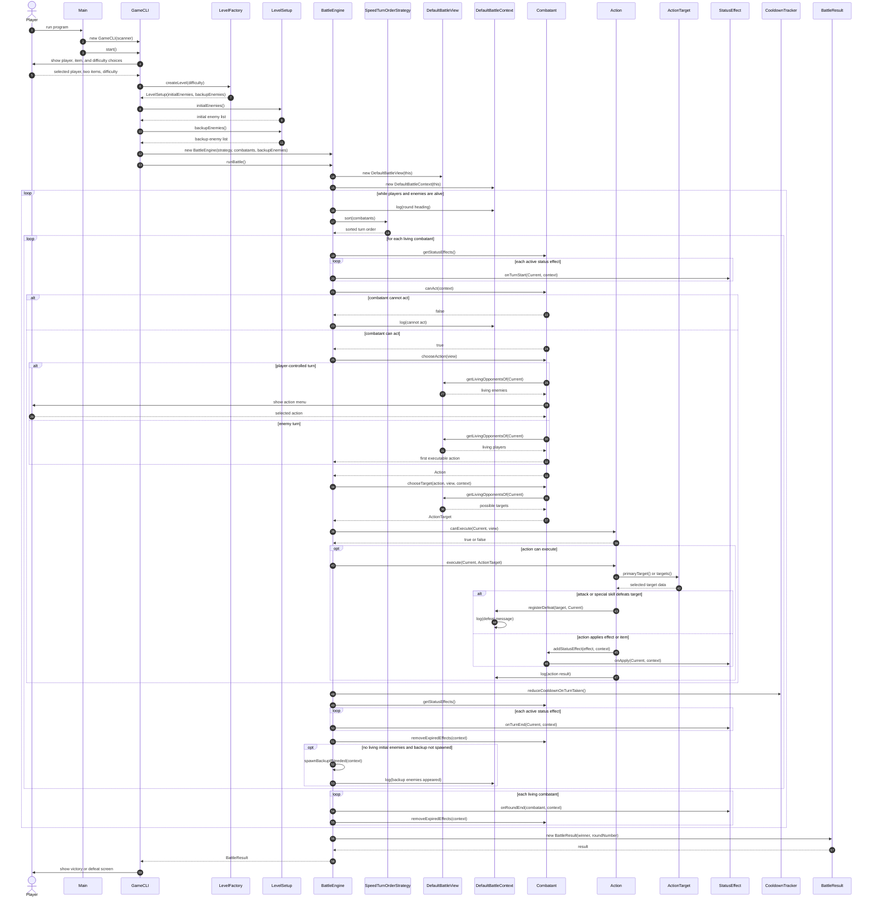

# UML Sequence Diagram (Current Battle Flow)

- Purpose:
  - show one complete battle scenario from CLI setup to battle result
  - include the main objects involved in setup, action choice, action execution, status effects, cooldowns, backup spawn, and result return

